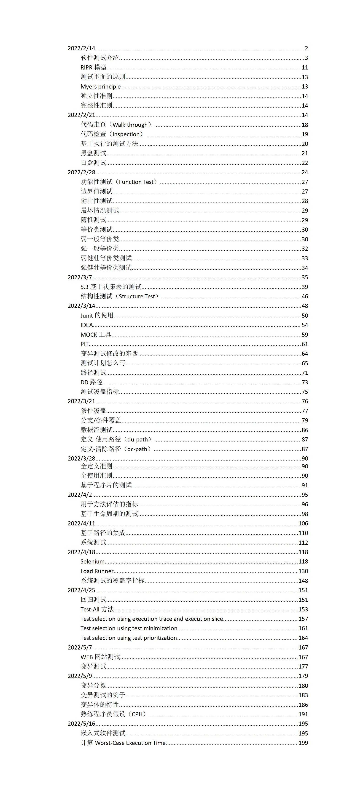

# SE213-2022-Notes
上海交通大学软件学院课程软件测试(SE213)笔记

## 课程简介
暂无。

## 说明

- 由于本学期的期末考核改为了大作业，所以本笔记并没有完整覆盖所有课程内容。
- 因为大部分笔记都是课上所记录，不可避免有疏漏之处，包括上课走神可能遗漏知识点。如果你发现了任何问题，欢迎vx联系我或者提交issue。欢迎你提交自己的补充知识点进来。
- 我想进一步推动软件学院中资料的流通，但我个人很难去以这种质量去维护所有课的笔记。欢迎有愿意分享资料的志愿者同学前往[软院笔记仓库](https://github.com/SJTU-SE/awesome-se-notes)贡献。
- 任何转载请引用这个仓库。

## 目录

